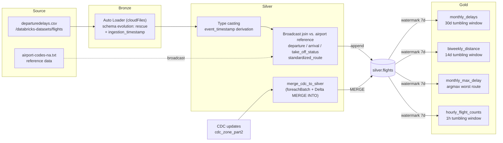

# Streaming Medallion Pipeline: Real-Time Flight Delay Analytics on Databricks

A fault-tolerant, continuously running data pipeline built with **Apache Spark Structured Streaming**, **Databricks Auto Loader**, and **Delta Lake**, implementing a full **Medallion Architecture** (Bronze → Silver → Gold) over a live flight-delay data feed — including out-of-order **Change Data Capture (CDC)** resolution and **event-time windowed aggregations** with watermarking.

Rather than a static batch ETL job, this pipeline is designed to run indefinitely: raw files land asynchronously, get incrementally picked up, cleaned, enriched, merged against late-arriving corrections, and rolled up into business-ready reporting tables — all as continuous streams, not one-off scripts.

---

## Why this exists

Batch ETL assumes your data arrives once, in order, and complete. Real systems don't work that way — files land out of order, upstream records get corrected after the fact, and reporting still needs to stay fresh without reprocessing everything from scratch. This project builds a pipeline that handles all three: **incremental ingestion** of asynchronous file arrivals, **stateful CDC merges** that resolve duplicate/out-of-order updates using sequence numbers, and **watermarked temporal aggregations** that tolerate late data without recomputing history.

---

## Architecture



### Bronze Layer — Incremental Ingestion

- Copies `departuredelays.csv` into a landing zone (`flight_landing_zone`)
- Databricks **Auto Loader** (`cloudFiles`) monitors the landing zone for new CSV arrivals
- `cloudFiles.schemaEvolutionMode = "rescue"` — new/unexpected columns are captured into a rescue column instead of breaking the stream
- Appends an `ingestion_timestamp` (`yyyy-MM-dd HH:mm:ss`) to every record to track exact arrival time
- Writes append-only to `bronze.flights` as a Delta table, triggered with `availableNow=True` (process everything currently available, then stop — no idle cluster cost)

### Silver Layer — Cleansing, Enrichment, Standardization

- Casts `delay`, `distance`, `origin`, `destination` to correct types
- The raw `date` field has no year — `"2025"` is prepended and parsed into a proper `event_timestamp`
- **Referential enrichment**: broadcast-joins the stream against a static IATA airport reference table (`airport-codes-na.txt`) twice (once for origin, once for destination) to resolve `departure` / `arrival` as `"City, State"`
- Derives `take_off_status` (`Early` / `On Time` / `Late` / `Delay`) from delay thresholds
- Derives a direction-agnostic `standardized_route` by alphabetically sorting and hyphenating the origin/destination IATA pair (e.g. `JNU-SEA`), so downstream aggregation doesn't double-count a route by direction
- Sets a `seq` literal (`3`) on freshly-ingested rows, reserving lower/higher sequence numbers for CDC corrections applied later
- Writes to `silver.flights`, append mode, `availableNow` trigger

### Change Data Capture — Resolving Out-of-Order Corrections

`merge_cdc_to_silver` (in `etl_stream_processor.ipynb`) processes a stream of CDC events via `foreachBatch`:
1. Parses the JSON `payload` column into a strict `StructType` schema
2. **Deduplicates within the microbatch** using a window function partitioned by `(date, standardized_route)`, ordered by `seq DESC` — only the highest sequence number per key survives
3. Executes a Delta **`MERGE INTO`** against `silver.flights`:
   - `whenMatchedUpdate` — applies the update only if the action is `U`/`update` **and** the incoming `seq` is strictly greater than the target's current `seq` (guards against replaying stale/out-of-order events)
   - `whenMatchedDelete` — same sequence guard, applied when the action is `D`/`delete`

This is the core of the CDC design: **sequence numbers, not arrival order, decide what wins** — so a correction that arrives late but has a higher `seq` still overwrites a newer-arriving-but-lower-`seq` record correctly.

### Gold Layer — Watermarked Temporal Aggregations

All four Gold queries read from the Silver stream with a **7-day watermark** on `event_timestamp` (bounding how late a record can arrive before it's dropped from a window), write in `complete` output mode, and each uses its own isolated checkpoint directory:

| Table | Window | Metric |
|---|---|---|
| `gold.monthly_delays` | 30-day tumbling | Average delay (converted to hours, rounded to 2 dp) |
| `gold.biweekly_distance` | 14-day tumbling | Total distance flown (rounded to 0 dp) |
| `gold.monthly_max_delay` | 30-day tumbling | Max delay in hours + the responsible route, via `max_by` (argmax) |
| `gold.hourly_flight_counts` | 1-hour tumbling | Flight count per hour |

---

## Tech stack

- **Apache Spark Structured Streaming** — the streaming DataFrame engine underneath everything
- **Databricks Auto Loader** (`cloudFiles`) — scalable, schema-evolving cloud file ingestion
- **Delta Lake** — ACID storage layer, `MERGE INTO` for CDC, time-travel-capable Bronze/Silver/Gold tables
- **Unity Catalog** — catalog/schema/volume hierarchy (`<roll_number>-pa2`.`bronze|silver|gold`)
- **PySpark SQL functions** — `window`, `withWatermark`, `broadcast`, `array_sort`, `max_by`, `from_json`

---

## Project structure

```
.
├── 26100355-pa2-part1.ipynb   # Part 1: Bronze layer + Silver (initial pass) + written Q&A
├── 26100355-pa2-part2.ipynb   # Part 2: Full Bronze→Silver→Gold pipeline, broadcast-join enrichment,
│                                #         gold aggregations, and results preview
├── data_ingestion.ipynb        # Producer notebook: configures landing-zone/CDC paths for the
│                                #         continuous simulation feeding Part 3
└── etl_stream_processor.ipynb  # Consumer notebook: full Bronze/Silver/Gold pipeline + CDC merge
                                 #         logic (merge_cdc_to_silver), scheduled to run continuously
```

---

## Design questions answered in the notebooks

**What is `schemaEvolutionMode` and when should it be used?**
It's an Auto Loader setting controlling how the pipeline reacts when incoming data's structure changes unexpectedly. `rescue` mode captures unrecognized columns into a side "rescued data" column instead of failing the stream — essential when ingesting raw external data whose schema you don't control.

**What trigger modes exist, and what's each for?**
- *Default* — processes the next microbatch immediately, lowest possible latency
- *Fixed-interval* (`ProcessingTime`) — processes on a set schedule, for predictable cluster usage
- *`availableNow`* — processes all currently available data, then shuts the stream down; used here to avoid paying for an always-on cluster
- *Continuous* — row-by-row processing for ultra-low latency

**How does a broadcast join optimize performance?**
It ships a full copy of a small table (the airport reference data) to every worker node, so the join executes locally on each partition — eliminating the network shuffle of the much larger streaming table that a standard join would require.

---

## Running it

1. Initialize Unity Catalog objects: a catalog `<roll_number>-pa2`, schemas `bronze` / `silver` / `gold`, and a `temp` volume with the required subdirectories (`flight_landing_zone`, `flight_landing_zone_part2`, `cdc_zone_part2`, `flight_reference_data`, `checkpoints`, `schemas`).
2. Run `26100355-pa2-part1.ipynb` then `26100355-pa2-part2.ipynb` for the batch-triggered (`availableNow`) end-to-end pipeline and Gold layer results.
3. For the continuous CDC scenario: run `data_ingestion.ipynb` to seed the Part 2 landing zones, then schedule/run `etl_stream_processor.ipynb`, which assembles Bronze → Silver (with CDC merges) → Gold as a standing streaming job.

---

## Known limitations / honest notes

- `data_ingestion.ipynb` currently only configures the landing-zone and CDC paths — the actual synthetic data/CDC event generator loop referenced in the assignment spec isn't present in this file and would need to be added for a truly self-contained continuous demo.
- The Silver `event_timestamp` derivation hardcodes the year `"2025"` since the source dataset's `date` field omits it — fine for this static dataset, not a general solution.
- Gold aggregations use `complete` output mode, meaning each trigger rewrites the full result table rather than incrementally appending — appropriate at this data volume, but worth revisiting (`update` mode) at scale.

---

## Acknowledgments

Built for *CS5305/CS621 — Scalable AI Services with Agentic AI, MLOps & LLMOps*, LUMS SBASSE, Spring 2026.
